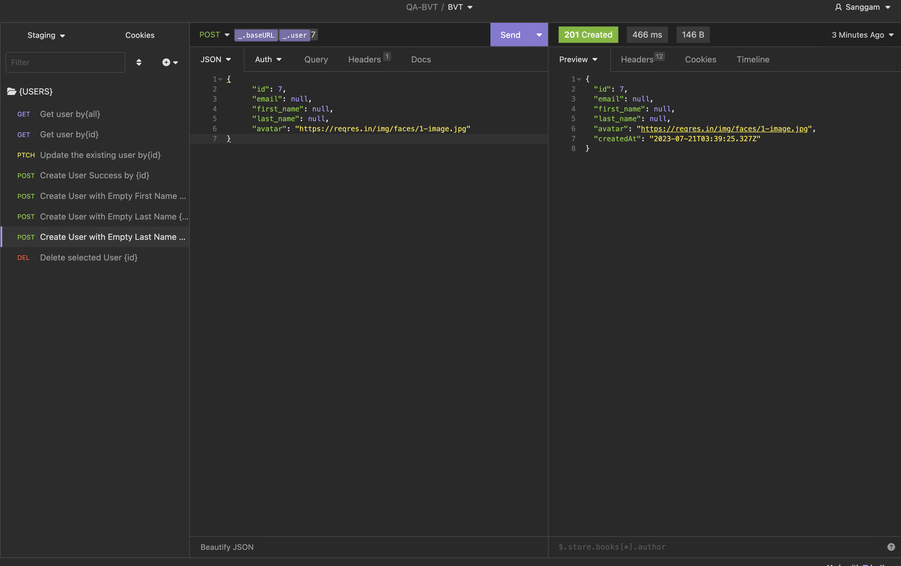

# BVT-Assesment

Scenario Outline : Validate the following behaviour of following <endpoint="https://reqres.in/api/users">

    Scenario: Create User Success
    Given I have valid user data
    When I send a POST request to "/api/users" with the data
    Then the response status code should be 201
    And the response should contain the user details
    And the user details should match the sent data

    Scenario: Create User with Empty Name
    Given I have user data with an empty first_name
    When I send a POST request to "/api/users" with the data
    Then the response status code should be 400
    And the response should contain an error message indicating the name is required

    Scenario: Create User with Empty Last Name
    Given I have user data with an null last_name
    When I send a POST request to "/api/users" with the data
    Then the response status code should be 400
    And the response should contain an error message indicating the last_name is required

    Scenario: Create User Without email is null
    Given I have valid user data
    And I do not include any authentication token
    When I send a POST request to "/api/users" with the data
    Then the response status code should be 400
    And the response should contain an error message indicating the email is required

    Scenario: Create User with Name Exceeding 100 Characters
    Given I have user data with a name exceeding 100 characters
    When I send a POST request to "/api/users" with the data
    Then the response status code should be 400
    And the response should contain an error message indicating the name length is too long

    Scenario: Create User with Name Less Than 1 Character
    Given I have user data with a name less than 1 character
    When I send a POST request to "/api/users" with the data
    Then the response status code should be 400
    And the response should contain an error message indicating the name length is too short

    Scenario: Create User with last_name Exceeding 100 Characters
    Given I have user data with a last_name exceeding 100 characters
    When I send a POST request to "/api/users" with the data
    Then the response status code should be 400
    And the response should contain an error message indicating the last_name length is too long

    Scenario: Create User with last_name Less Than 1 Character
    Given I have user data with a last_name less than 1 character
    When I send a POST request to "/api/users" with the data
    Then the response status code should be 400
    And the response should contain an error message indicating the last_name length is too short

    Scenario: Get User by Valid ID
    Given I have a valid user ID
    When I send a GET request to "/api/users/{id}" with the ID
    Then the response status code should be 200
    And the response should contain the user details for the given ID

    Scenario: Get User by Invalid ID
    Given I have an invalid user ID
    When I send a GET request to "/api/users/{id}" with the ID
    Then the response status code should be 404
    And the response should contain an error message indicating the user is not found

    Scenario: Get User by ID with Non-numeric Value
    Given I have a non-numeric user ID
    When I send a GET request to "/api/users/{id}" with the ID
    Then the response status code should be 400
    And the response should contain an error message indicating the ID must be numeric

    Scenario: Update User by Valid ID
    Given I have a valid user ID and updated data
    When I send a PUT request to "/api/users/{id}" with the ID and updated data
    Then the response status code should be 200
    And the response should contain the updated user details

    Scenario: Update User by Invalid ID
    Given I have an invalid user ID and updated data
    When I send a PUT request to "/api/users/{id}" with the ID and updated data
    Then the response status code should be 404
    And the response should contain an error message indicating the user is not found

    Scenario: Update User by ID with Non-numeric Value
    Given I have a non-numeric user ID and updated data
    When I send a PUT request to "/api/users/{id}" with the ID and updated data
    Then the response status code should be 400
    And the response should contain an error message indicating the ID must be numeric

    Scenario: Delete User by Valid ID
    Given I have a valid user ID
    When I send a DELETE request to "/api/users/{id}" with the ID
    Then the response status code should be 204
    And the user with the given ID should be deleted

    Scenario: Delete User by Invalid ID
    Given I have an invalid user ID
    When I send a DELETE request to "/api/users/{id}" with the ID
    Then the response status code should be 404
    And the response should contain an error message indicating the user is not found

    Scenario: Delete User by ID with Non-numeric Value
    Given I have a non-numeric user ID
    When I send a DELETE request to "/api/users/{id}" with the ID
    Then the response status code should be 400
    And the response should contain an error message indicating the ID must be numeric

    Scenario: List Users with Valid Page Number
    Given I have a valid page number
    When I send a GET request to "/api/users?page={page}" with the page number
    Then the response status code should be 200
    And the response should contain the list of users for the given page

    Scenario: List Users with Invalid Page Number
    Given I have an invalid page number
    When I send a GET request to "/api/users?page={page}" with the page number
    Then the response status code should be 400
    And the response should contain an error message indicating the page number is invalid

    Scenario: List Users with Non-numeric Page Number
    Given I have a non-numeric page number
    When I send a GET request to "/api/users?page={page}" with the page number
    Then the response status code should be 400
    And the response should contain an error message indicating the page number must be numeric

    Scenario: List Users with Valid Per Page Value
    Given I have a valid "per_page" value
    When I send a GET request to "/api/users?per_page={per_page}" with the per_page value
    Then the response status code should be 200
    And the response should contain the list of users with the specified per_page value

    Scenario: List Users with Invalid Per Page Value
    Given I have an invalid "per_page" value
    When I send a GET request to "/api/users?per_page={per_page}" with the per_page value
    Then the response status code should be 400
    And the response should contain an error message indicating the per_page value is invalid

    Scenario: List Users with Non-numeric Per Page Value
    Given I have a non-numeric "per_page" value
    When I send a GET request to "/api/users?per_page={per_page}" with the per_page value
    Then the response status code should be 400
    And the response should contain an error message indicating the per_page value must be numeric

    Scenario: List Users with Valid Page Number and Per Page Value
    Given I have a valid page number and per_page value
    When I send a GET request to "/api/users?page={page}&per_page={per_page}" with the page number and per_page value
    Then the response status code should be 200
    And the response should contain the list of users for the given page and per_page value

    Scenario: List Users with Invalid Page Number and Per Page Value
    Given I have an invalid page number and per_page value
    When I send a GET request to "/api/users?page={page}&per_page={per_page}" with the page number and per_page value
    Then the response status code should be 400
    And the response should contain an error message indicating the page number and/or per_page value is invalid

## API Collection
As in the following API Collection already listed here.
[ Endpoint Collection of API](QABVTCollection.json) - Import as to Postman/ Insomnia as the following test cases submitted in Description

Assume the import successfully will return the following payload that is needed to submit the API Test.

